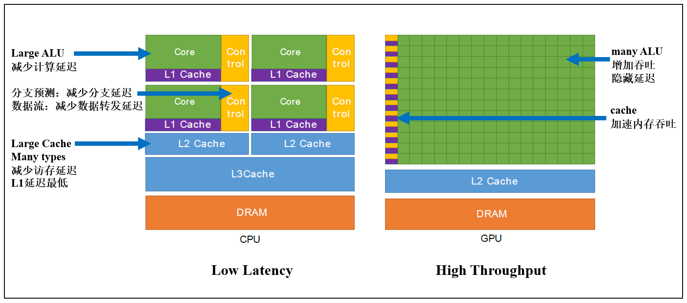
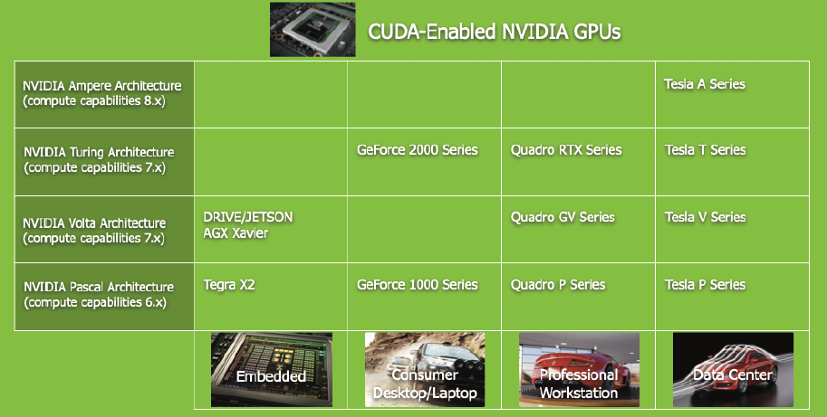
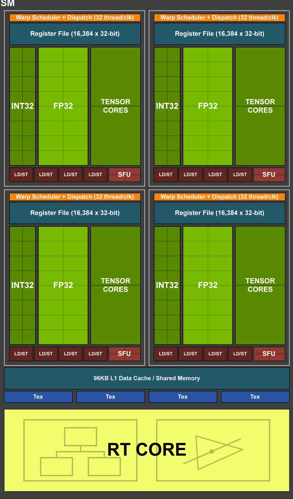
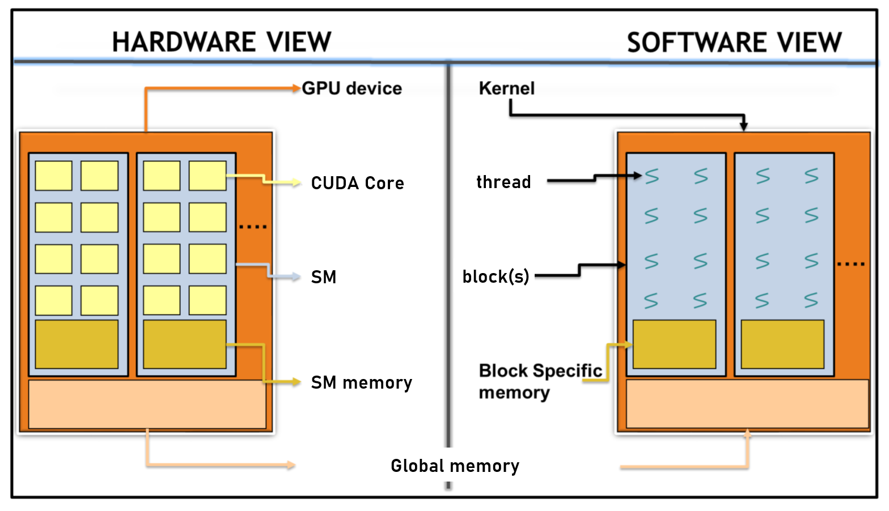

# 00. 前言

## <font color=cyan>01. HPC</font>

==**FLOPs**== : ==**Floating-Point Operations**==   FLOPs per second 测量计算处理器理论峰值的基本单位

==**ILP**== : ==**Instruction-Level Parallelism**==   代码不相关的指令可以同时执行

```assembly
# 指令1-2不相关，可并行，指令3依赖1-2
Instr 1: add = inp1 + inp2
Instr 2: mult = inp1 * inp2
Instr 3: final_result = mult / add
```

==**GPGPU**== : ==**General Purpose Computation using GPU**==

CUDA在2007年引入

## <font color=cyan>02. 异构计算</font>



==**SIMT**== ：==**Single Instruction Multiple Threads**==   多线程执行相同指令用于不同数据

由于CPU以非常高的时钟速度运行，因此有必要将频繁使用的数据存储在缓存中，并预测下一条执行指令，从而隐藏获取数据的延迟。

==**GPU隐藏延迟**==：当一个线程正在等待数据可用来计算时，其他线程可以开始执行，因此不会浪费任何时钟周期。

为什么不能在CPU端这么做来隐藏延迟呢？因为CPU寄存器有限，线程上下文通常存储在cache中，切换慢，而GPU寄存器数量多，线程contex switch信息都存储在寄存器中。

## <font color=cyan>03. GPU产品线</font>



## <font color=cyan>04. GPU架构</font>

> 参考：https://jcf94.com/2020/05/24/2020-05-24-nvidia-arch/

* <font color=cyan>**K80 -- Kepler架构**</font> 计算能力3.7

  

  48 SMs

  64 KB register  / per SM

  64KB L1 Cache / Shared Memory

  每个SM 192个CUDA Core

  4992 CUDA Cores

  

* <font color=cyan>**T40 -- Turing架构 TU104**</font> 计算能力7.5

  

  48 SMs

  256 KB register  / per SM

  96KB L1 Cache / Shared Memory

  CUDA Core拆分为 INT32 和 FP32 处理单元（从Volta架构开始），每个SM 64个CUDA Core

  3072 CUDA Cores

  368 Tenso Cores

  48 RT Cores

## <font color=cyan>05. 线程层次</font>



