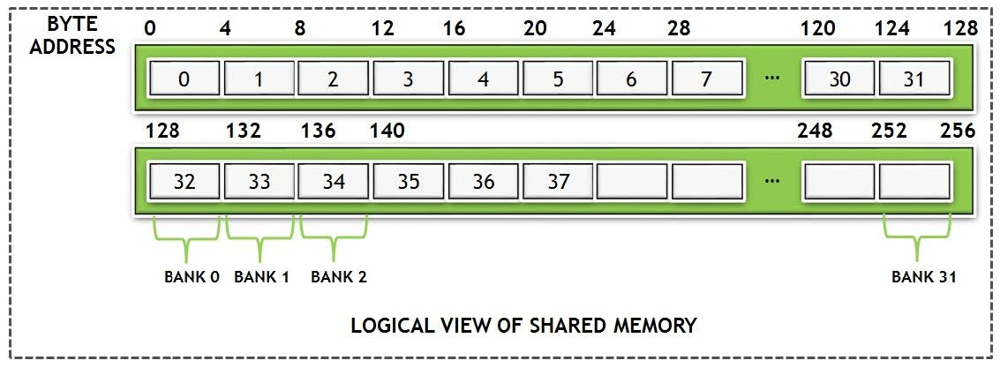

# 02. 内存管理

## 01. Device Memory

可以分配==线性内存==或者==cuda array==

线性内存：==cudaMalloc== ==cudaFree== ==cudaMemcpy==，也可以通过==cudaMallocPitch== 和 ==cudaMalloc3D==分配2D或3D数组，它们可以保证分配内存是对齐的，相应的memcpy为==cudaMemcpy2D==和==cudaMemcpy3D==

访问device上的全局变量：==cudaMemcpyToSymbol== ==cudaMemcpyFromSymbol== 

==最小化host和device之间的内存传输==

* move more code from host to device，这样更多的中间数据结构在device上被处理
* batching many small transfers into a single large transfer
* using page-locked host memory

## 02. Global Memory

线程对global memory的访问是合并的，32-，64-，128- bytes内存事务，这些内存事务必须是自然对齐的

当一个warp执行一条访问全局内存的指令时，它根据每个线程访问的内存大小和线程间内存地址的分布，将该warp内线程的内存访问合并为一个或多个内存事务。当访问的地址不连续时，就会产生多个内存事务，举例：每个线程访问4-bytes数据，并且内存地址分布没有连续性，那么就需要为每个线程准备一个32-bytes的内存事务

为了最大化global memory的内存吞吐，需要尽可能==最大化合并内存访问==

* ==计算能力3.5==
  * global memory通常会cache进L2 cache或者只读cache中，通常不会cache进L1 cache
  * cache line = 128 bytes
  * 只在L2中缓存的数据会以32-bytes大小的内存事务进行访问
  * L2 cache可以减少over-fetch

## 02. Shared Memory

比local memory和global memory拥有更高的bandwidth和更低的latency

==bank== : 共享内存被划分为多个相等的内存块，可以被同时访问，增加带宽

==bank conflict== : 同一个bank被warp内两个不同线程同时访问，发生bank conflict时，并行的指令将会序列化执行，降低效率，下图T1和T2中的指令将会顺序执行

如何解决？

> All this does is pad the shared memory with a dummy, that is, one additional column, which results in threads accessing different banks and hence resulting in better performance:

## 01. Data Transfer between Host and Device

最小化host和device之间的内存传输

* move more code from host to device，这样更多的中间数据结构在device上被处理
* batching many small transfers into a single large transfer
* using page-locked host memory

## 02. Device Memory Access

